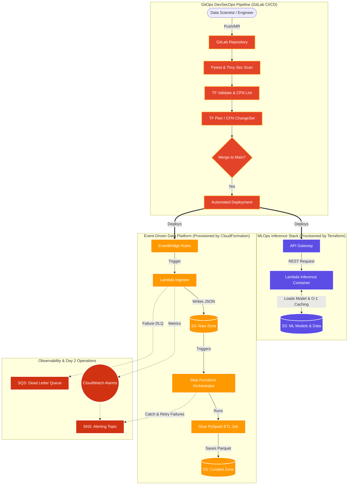

# 🌿 Project SAGE: Serverless Automated GitOps Environment

**SAGE** is a zero-touch, self-service MLOps platform designed to reduce the time-to-market for Machine Learning models from weeks to minutes.

By leveraging GitOps principles, modular Terraform, and AWS Serverless infrastructure, SAGE empowers Data Scientists to instantly provision compliant, secure, and highly scalable inference environments without requiring manual IT intervention.

## 🎯 The Problem vs. The SAGE Solution

* **The Problem:** Data Science teams often face significant friction when transitioning models from local Jupyter Notebooks to production REST APIs. Infrastructure provisioning relies on manual IT tickets, leading to configuration drift, security vulnerabilities, and blocked deployments.
* **The SAGE Solution:** A standardized GitOps pipeline. A Data Scientist simply adds their project configuration to the repository. SAGE automatically runs unit tests, scans for CVEs, provisions isolated AWS infrastructure (S3, API Gateway, Lambda/ECR), and wires up a production-ready HTTP endpoint.

## ✨ Core Platform Features

* **Self-Service IaC (Terraform):** Standardized modules ensure every deployed model environment includes FinOps cost-tracking tags, encrypted-at-rest S3 buckets, and least-privilege IAM roles by default.
* **DevSecOps & Shift-Left Security:** Integrated **Trivy** scanning fails the pipeline automatically if `MEDIUM`, `HIGH`, or `CRITICAL` vulnerabilities are detected in the infrastructure or Python dependencies.
* **Cold-Start Optimized Compute:** The serverless inference layer (AWS Lambda via Docker/ECR) uses an object-oriented Python architecture to cache the ML model in memory, reducing warm-start inference latency to milliseconds.
* **Fail-Fast Data Validation:** The API layer rejects malformed JSON or incorrect data types in $O(N)$ time, preventing expensive and unnecessary compute cycles.

## 📂 Repository Structure

```text
project-sage/
├── .gitlab-ci.yml                 # DevSecOps Pipeline (Test, Scan, Plan, Apply)
├── main.tf                        # GitOps Entrypoint (Developer declarations)
├── modules/
│   └── ml_workspace/              # Reusable Terraform module
│       ├── api_gw.tf              # HTTP API Gateway
│       ├── iam.tf                 # Least-privilege execution roles
│       ├── lambda.tf              # Serverless compute (ECR Image mapping)
│       └── s3.tf                  # Model artifact storage
├── src/
│   ├── app.py                     # Optimized model loading & inference logic
│   ├── Dockerfile                 # Custom AWS Lambda container definition
│   └── requirements.txt           # ML dependencies (scikit-learn, joblib, etc.)
└── tests/
    └── test_app.py                # Pytest suite with Boto3/S3 mocking

```

## 🚀 How to Deploy

### Prerequisites

* AWS CLI configured with administrator/provisioning credentials.
* Terraform `v1.5+` installed.
* Docker daemon running.

### Local Deployment (For Testing)

1. **Clone the repository:**
```bash
git clone https://github.com/yourusername/project-sage.git
cd project-sage

```


2. **Run the test suite:**
```bash
pytest tests/test_app.py

```


3. **Initialize and Apply Terraform:**
```bash
terraform init
terraform plan
terraform apply -auto-approve

```


4. **Test the live endpoint:**
```bash
curl -X POST $(terraform output -raw api_endpoint)/predict \
-H "Content-Type: application/json" \
-d '{"features": [1.5, 0.5, 3.2]}'

```


## 🧑‍💻 The Developer Workflow (GitOps)

1. **Request:** A Data Scientist submits a Merge Request adding a new module block to `main.tf` (e.g., `module "fraud_detection"`).
2. **Test & Scan:** GitLab CI automatically runs Pytest and Trivy.
3. **Review:** The Platform Team reviews the automated `terraform plan` output generated in the MR.
4. **Merge & Provision:** Upon merging to `main`, the infrastructure is automatically provisioned and the Data Scientist receives their secure S3 bucket and API URL.

## 🛣️ Future Roadmap

* **Kubernetes (EKS) Migration Path:** While SAGE currently uses Lambda/ECR for cost-effective burst traffic, future iterations will include a toggle to deploy heavier workloads (e.g., LLMs requiring GPUs) to an EKS cluster running KServe.
* **Automated Model Retraining:** Integrating AWS EventBridge and Step Functions to trigger automated retraining pipelines when data drift is detected.

---



*Developed by phos-x for Platform Engineering & MLOps demonstrations.*
